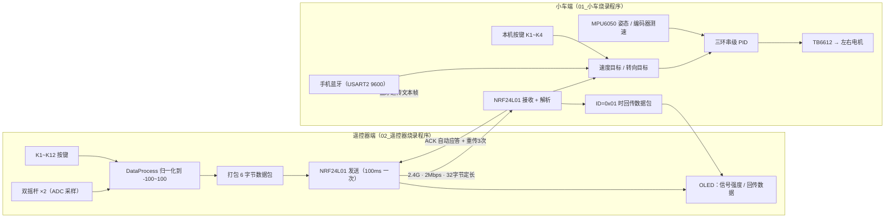
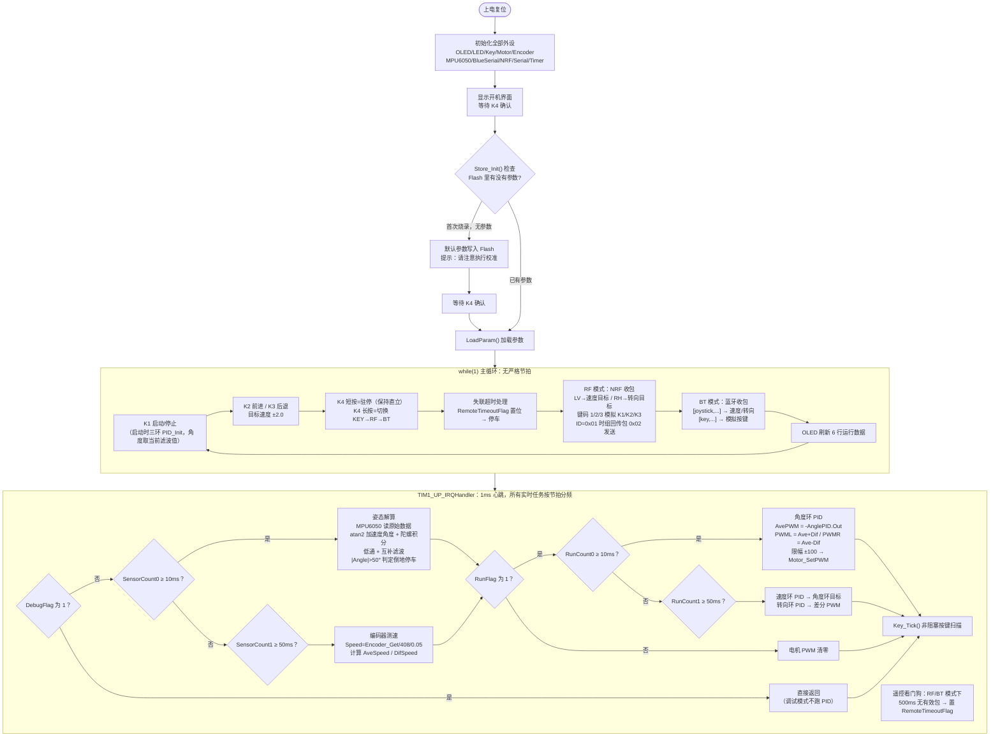
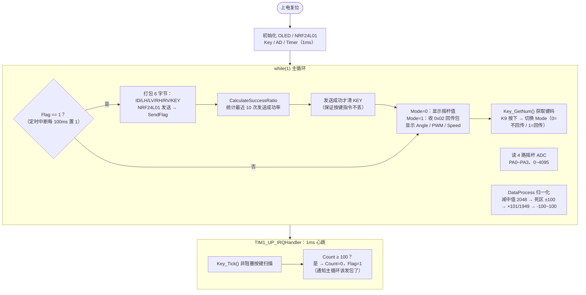

# 00 · 整体代码框架与流程图

[返回项目首页](../README.md) · [下一篇：项目总览与硬件组成](./01_项目总览与硬件组成.md)

> 面向读者：第一次打开这份源码、想知道"程序从哪开始、每个文件干什么、中断里在算什么"的人。
> 本文件只讲框架，不逐行讲代码。逐行导读见 [04 · 代码导读](./04_代码导读.md)。

---

## 一、双端系统总体架构

这套项目是**两块独立的 STM32F103C8T6 板子 + 一条 2.4G 无线链路**组成的闭环：

- **小车端**负责"平衡 + 执行"：读姿态、测轮速、跑三环 PID、驱动电机，同时监听三类输入（本机按键 / NRF 手柄 / 手机蓝牙）。
- **遥控器端**负责"输入 + 反馈"：读双摇杆和 12 个按键，每 100ms 打包发给小车，并可选接收小车回传的姿态/速度数据在 OLED 上显示。



一句话记住分工：**遥控器只发指令，小车只管平衡；小车偶尔回传"我现在多快、多斜"，遥控器负责显示。**

---

## 二、小车端整体代码框架

小车端的主程序在 `01_小车烧录程序/User/main.c`，**`main()` 只做初始化和显示，真正干活的循环有两层**：

1. `while(1)` 主循环——处理按键、遥控包、显示，节奏"随便"（不精确，但都很快）；
2. `TIM1_UP_IRQHandler` 1ms 定时中断——**所有需要精确节拍的事（姿态、测速、PID）都在这**。



### 小车端 1ms 中断时间片调度表

`SensorCount0 / SensorCount1 / RunCount0 / RunCount1` 四个计数器在中断里各自分频，互不阻塞，全部"到点就做"：

| 周期 | 任务 | 用的计数器 | 涉及模块 |
|---|---|---|---|
| 1ms | 非阻塞按键扫描 | 每次进入都调 | `Key.c` |
| 1ms | 遥控看门狗计时（RF/BT 模式） | 每次进入都调 | `main.c` 全局变量 |
| 10ms | 读 MPU6050 → 姿态解算 → 互补滤波 → 倒地检测 | `SensorCount0` | `MPU6050.c / MyI2C.c` |
| 10ms | 角度环 PID → 合成左右 PWM → 限幅 → 输出电机 | `RunCount0` | `PID.c / Motor.c` |
| 50ms | 编码器测速 → 均速 / 差速 | `SensorCount1` | `Encoder.c` |
| 50ms | 速度环 PID（输出=角度环目标）+ 转向环 PID（输出=差分 PWM） | `RunCount1` | `PID.c` |

注意执行顺序：**同一轮中断里，先算 10ms 的姿态和角度环（用上一轮 50ms 更新的目标），后算 50ms 的测速和速度/转向环（为下一轮准备新目标）**。速度环每 50ms 更新一次角度目标，角度环每 10ms 追一次目标。

---

## 三、遥控器端整体代码框架

遥控器端主程序在 `02_遥控器烧录程序/User/main.c`，结构比小车端简单得多：主循环里采样、处理、发送、显示，定时中断只负责两件事——按键扫描和 100ms 置发送标志。



### 遥控器端时间片调度表

| 周期 | 任务 | 说明 |
|---|---|---|
| 1ms | 按键扫描 `Key_Tick()` | 与小车端同一套非阻塞驱动 |
| 100ms | `Flag` 置 1 | 主循环看到 Flag 才组包发送 |
| 主循环（≈ms 级） | 采样 4 路 ADC → 归一化 → 发送 → 成功率统计 → 显示 | 无严格节拍 |

**为什么发包要固定在 100ms？** 因为 NRF24L01 是半双工，发送期间不能收；小车回传包也要走同一根天线。100ms 发包 + 自动应答，收发错开，信号才稳定。手机上发蓝牙指令时建议同样用 50~100ms 的间隔。

---

## 四、工程文件结构

```
平衡车双端烧录总包/
├── 01_小车烧录程序/                ← 小车端 Keil 工程
│   ├── User/                      ← 主程序与算法
│   │   ├── main.c                 ← 主流程 + TIM1 1ms 中断（核心调度）
│   │   ├── PID.c / PID.h          ← 位置式 PID（三个环共用）
│   │   ├── DebugMode.c / .h       ← 调试菜单（写好但未接线，见 04 篇）
│   │   └── stm32f10x_it.c         ← 其他中断服务函数
│   ├── Hardware/                  ← 外设驱动（江协科技开源驱动）
│   │   ├── OLED.c / OLED_Data.c   ← SSD1306 显示
│   │   ├── Key.c                  ← 非阻塞按键状态机
│   │   ├── LED.c / Motor.c / PWM.c← 指示灯 / 电机方向 / TIM2 20kHz PWM
│   │   ├── Encoder.c              ← TIM3/TIM4 编码器测速
│   │   ├── MPU6050.c / MyI2C.c    ← 软件 I2C 读姿态
│   │   ├── NRF24L01.c             ← 软件 SPI 驱动 2.4G 无线
│   │   ├── Serial.c               ← USART1 调试串口
│   │   └── BlueSerial.c           ← USART2 蓝牙透传
│   ├── System/
│   │   ├── Timer.c                ← TIM1 配置为 1ms 更新中断
│   │   ├── Delay.c                ← 软件延时
│   │   └── Store.c / MyFLASH.c    ← 参数存 Flash
│   ├── Library/                   ← STM32F10x 标准外设库
│   └── Start/                     ← 启动文件、系统时钟
│
├── 02_遥控器烧录程序/              ← 遥控器端 Keil 工程
│   ├── User/
│   │   ├── main.c                 ← 主流程 + TIM1 1ms 中断
│   │   └── stm32f10x_it.c
│   ├── Hardware/
│   │   ├── OLED.c / OLED_Data.c
│   │   ├── Key.c                  ← 12 键（K1~K10 + 2 摇杆键）
│   │   ├── AD.c                   ← ADC1 四路摇杆采样
│   │   └── NRF24L01.c             ← 接线与小车端不同（PB11~PB15）
│   ├── System/（Timer.c / Delay.c）
│   ├── Library/
│   └── Start/
│
├── 03_说明书和原理图/              ← 使用说明书 + 两张原理图 PDF
├── STM32平衡车教学文档/            ← 本套教学文档（你正在看的目录）
└── 先看我_小车和遥控器烧录说明.md
```

## 五、模块职责速查

| 模块 | 文件 | 干什么 | 关键函数 |
|---|---|---|---|
| 定时器 | `System/Timer.c` | TIM1 配成 1ms 更新中断，整个工程的"心跳" | `Timer_Init()` |
| 姿态 | `Hardware/MPU6050.c` | 软件 I2C 读加速度/陀螺仪原始数据 | `MPU6050_Init/GetData` |
| 测速 | `Hardware/Encoder.c` | 定时器编码器模式读左右轮转速 | `Encoder_Get(n)` |
| 电机 | `Hardware/PWM.c` + `Motor.c` | TIM2 输出 20kHz PWM；TB6612 方向与占空比 | `Motor_SetPWM(1/2, ±100)` |
| 无线 | `Hardware/NRF24L01.c` | 软件 SPI 驱动 NRF24L01 收发 | `NRF24L01_Receive/Send` |
| 蓝牙 | `Hardware/BlueSerial.c` | USART2 收文本帧并切词 | `BlueSerial_ReceiveFlag/Receive` |
| 按键 | `Hardware/Key.c` | 非阻塞状态机：单击/长按/连发 | `Key_Tick`（中断里）+ `Key_Check`（主循环） |
| 显示 | `Hardware/OLED.c` | SSD1306 显示与绘图 | `OLED_Printf/Update/DrawLine` |
| 存储 | `System/Store.c` | 参数存取 Flash | `Store_Init/SaveParam/LoadParam` |
| PID | `User/PID.c` | 位置式 PID（含积分限幅/微分先行/死区补偿） | `PID_Init/Update` |
| 调试菜单 | `User/DebugMode.c` | 硬件测试/校准菜单（**当前固件未接线**） | `DebugMode()` |

> **一个必须知道的真相**：`DebugMode()` 函数写好了，但 `main.c` 里没有任何调用它的地方——现成固件里**进不去调试菜单、也进不去校准流程**。原因和启用方法见 `04_代码导读.md` 最后一节，这是本工程源码里唯一一处"写了但没接上"的功能。
