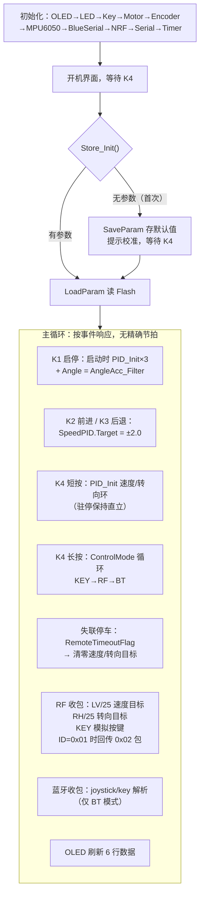
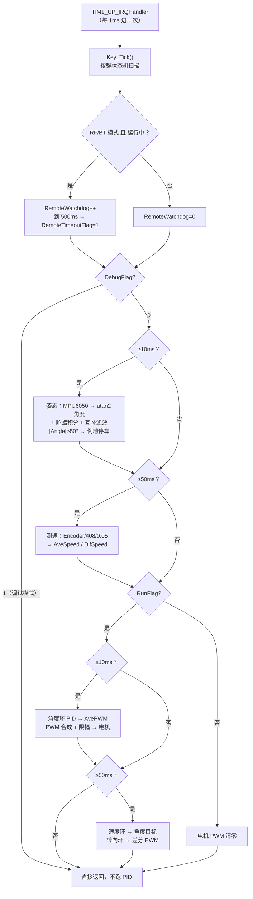

# 04 · 代码导读

[上一篇：双端无线通信协议](./03_双端无线通信协议.md) · [返回项目首页](../README.md) · [下一篇：烧录调试排错](./05_烧录调试排错.md)

> 面向读者：已经烧录成功、想把 `main.c` 从头到尾读懂的人。
> 整体框架与时间片总表见 [00 · 整体代码框架与流程图](./00_整体代码框架与流程图.md)，本文是逐段导读。

## 一、main.c 主流程（分段导读）



**开机环节的细节**（常被忽略，但对使用很重要）：

1. 上电先显示"江协科技 / 平衡车测试程序 V1.0"，**必须按 K4 才继续**——防止上电瞬间车自己跑起来；
2. `Store_Init()` 检查 Flash 里有没有参数钥匙（0xB5B5）。首次烧录没有 → 写默认参数 + 提示"已重置参数，请注意执行校准"，等 K4 确认；之后每次上电 `LoadParam()` 读回；
3. 校准流程（GY_Offset、AngleAcc_Offset）写在 `DebugMode.c` 里，但**现成固件进不去**，见本文最后一节。

## 二、1ms 中断：全工程真正的"发动机"



**关键设计**：四个计数器各自独立分频，互不等待——10ms 的姿态和角度环、50ms 的测速和速度/转向环在同一中断里交错执行，谁到点谁做。所以角度环的 5 次计算之间会插 1 次速度环更新，这是串级控制正常的"目标每 50ms 变一次，内环每 10ms 追一次"。

## 三、模块调用关系与关键函数

| 文件 | 关键函数 | 被谁调用 | 作用 |
|---|---|---|---|
| `Timer.c` | `Timer_Init()` | main 初始化 | TIM1 配成 1ms 更新中断 |
| `Key.c` | `Key_Tick()` / `Key_Check()` | 中断 / 主循环 | 非阻塞按键状态机 |
| `MPU6050.c` | `MPU6050_GetData()` | 10ms 中断 | 读六轴原始数据 |
| `Encoder.c` | `Encoder_Get(n)` | 50ms 中断 | 读编码器计数值 |
| `PID.c` | `PID_Update()` | 10/50ms 中断 | 三环共用算法 |
| `Motor.c` | `Motor_SetPWM(n, ±100)` | 10ms 中断 | 限幅并输出电机 |
| `NRF24L01.c` | `NRF24L01_Receive()/Send()` | 主循环 | 收控制包 / 发回传包 |
| `BlueSerial.c` | `BlueSerial_ReceiveFlag()/Receive()` | 主循环 | 收蓝牙文本帧并切词 |
| `Store.c` | `Store_Init/SaveParam/LoadParam` | 开机 | 参数存取 Flash |

## 四、按键状态机（Key.c）

四个键共用一套**非阻塞状态机**，不占用主循环等待：

- 每 1ms `Key_Tick()` 被调一次，内部每 **20ms** 采样一次电平——这就是消抖（机械抖动发生在两次采样之间，读到的自然是稳定电平）；
- 事件类型：`KEY_DOWN/UP`（按下/松开沿）、`KEY_SINGLE`（单击）、`KEY_LONG`（长按 1000ms）、`KEY_REPEAT`（长按期间每 100ms 连发）、`KEY_HOLD`（按住中）；
- `Key_Check()` 查询事件后自动清除（HOLD 除外），保证"一次按下只触发一次动作"；
- 蓝牙/NRF 收到按键指令时，直接 `Key_Flag[KEY_n] |= KEY_SINGLE` **模拟实体按键**——远程按键和本地按键走同一条处理路径。

状态机流转（S 状态）：空闲 0 → 按下计时 1 →（满 1000ms）长按连发 4 →（提前松开）等双击 2 →（再按下）双击 3。本工程 KEY_TIME_DOUBLE=0，即松开立即判定为单击。

## 五、参数存储（Store.c / MyFLASH.c）

Flash 布局（16 位字）：

| 偏移 | 内容 |
|---|---|
| [0] | 钥匙 0xB5B5（判断是否有有效参数） |
| [1] | SpeedLevel（速度档位，默认 4） |
| [2] | GY_Offset（陀螺零点校准） |
| [3..4] | AngleAcc_Offset 低半字 / 高半字（float 拆两个 16 位） |

浮点数存 Flash 的方法：`float` 是 4 字节，Flash 按 16 位半字擦写，所以拆成两个 16 位存储，读回时再拼回 `float`。**修改 PID 参数后想让新值生效，需要重烧程序（钥匙被清除后重新存默认值）**，否则每次上电 LoadParam 会把你改的参数覆盖回 Flash 旧值。

## 六、控制数据流（一条线串起来）

```
遥控摇杆 LV ──► SpeedPID.Target（±4.0）
                SpeedPID(50ms)：Actual=AveSpeed → Out → AnglePID.Target（±10°）
                AnglePID(10ms)：Actual=Angle → Out → AvePWM = -Out（±100）
遥控摇杆 RH ──► TurnPID.Target
                TurnPID(50ms)：Actual=DifSpeed → Out → DifPWM（±30）
                PWML = AvePWM + DifPWM
                PWMR = AvePWM − DifPWM      （限幅 ±100）
                    │
                    ▼
                Motor_SetPWM → TB6612 → 左右电机
                    │
                    ├─► 编码器 ──► SpeedLeft/Right ──► AveSpeed/DifSpeed（回速度环/转向环）
                    └─► MPU6050 ──► Angle（回角度环）
```

## 七、关于 DebugMode：一个必须说清楚的"未接线"功能

`DebugMode.c` 里写好了完整的调试菜单（硬件测试、参数校准、数据存取），但 `main.c` 中**没有任何调用它的代码**——搜索全工程，`DebugMode()` 只存在于文件里，从没被调用过。

这意味着现成固件里：**校准功能不可达**（GY_Offset、AngleAcc_Offset 只能保持出厂默认 0）。车如果明显朝一边倒，需要通过下面方式启用调试模式：

```c
// 在 main.c 的 while(1) 之前（比如 LoadParam() 之后）加一行：
DebugFlag = 1;
// 然后在主循环末尾（OLED_Update() 之前）加一行：
DebugMode();
```

重新编译烧录后，K4 可进入调试菜单。**改完记得调参满意后把这两行删掉**（或 DebugFlag 置 0），否则 1ms 中断里的 PID 不执行，车不会平衡。

> 为什么原厂没接上：这版固件是"双遥控 + 三环 PID"功能验证版，调试菜单是开发期工具，发布时被留着但没挂进主流程。把它当成一个"预留接口"即可，不影响小车正常使用。
